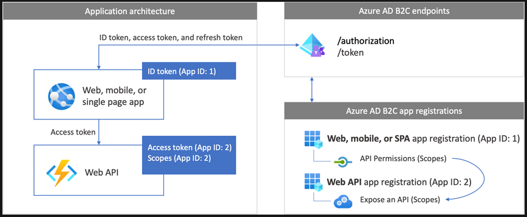

# JavaScript Single-page Application secured with MSAL.js

NOTE: This workshop is based on the following example projects:
* [ms-identity-javascript-v2](https://github.com/Azure-Samples/ms-identity-javascript-v2)
* [ms-identity-javascript-tutorial](https://github.com/Azure-Samples/ms-identity-javascript-tutorial/tree/main/3-Authorization-II/1-call-api)

## Description
A simple JavaScript single-page application which demonstrates how to configure [MSAL.JS 2.x](https://www.npmjs.com/package/@azure/msal-browser) to login, logout, and acquire an access token for a protected resource behind **Salling Group API Management**. This version of the MSAL.js library uses the [authorization code flow with PKCE](https://docs.microsoft.com/azure/active-directory/develop/v2-oauth2-auth-code-flow).
## Prerequisites

[Node](https://nodejs.org/en/) must be installed to run this sample.
## Scenario
Salling Group needs a portal that lets Salling Group Employees log in using their Microsoft work account. The portal has two levels of access, Employee.Read and Employee.Admin. We call these **Roles**. Depending on the what a user has been assigned the following Salling Group APIs are available:

### Employee.Read
[Stores OAS](https://oas-internal-website.goodest.cloud/#/Stores)

* GET https://api.sallinggroup.com/v2/stores
* GET https://api.sallinggroup.com/v2/stores/{id}
### Employee.Admin
[Stores OAS](https://oas-internal-website.goodest.cloud/#/Stores),
[Products OAS](https://oas-internal-website.goodest.cloud/#/Products/get-products-ean)

* GET https://api.sallinggroup.com/v2/stores
* GET https://api.sallinggroup.com/v2/stores/{id}
* GET https://api.sallinggroup.com/v2/products/{ean}

The mapping of Roles to APIs are defined in an OAuth product by the API Team. The OAuth product is available to the API Gateway.
## Setup
   * **Frontend** App Registration = App ID:1
   * **Backend** App Registration = App ID:2

1. The **Frontend** App Registration uses the **MSAL.js** library to sign-in a Salling Group Employee and obtain a JWT **Access Token** from **Azure AD**.
1. The **Access Token** is used as a **bearer** token to **authorize** the user to call protected Salling Group APIs.
   * The API Gateway authorizes the User based on the Roles assigned in the **Backend** App Registration

Web API = Salling Group API at **api.sallinggroup.com**

In depth description can be found [HERE](https://learn.microsoft.com/en-us/azure/active-directory-b2c/configure-authentication-in-sample-node-web-app-with-api)
## Key concepts

This sample demonstrates the following MSAL workflows:

* How to configure application parameters.
* How to sign-in with popup and redirect methods.
* How to sign-out.
* How to acquire an access token.
* How to make an API call with the access token.

## How to start a project that needs an Application secured with MSAL

1. Get in contact with the API Team: apisupport@sallinggroup.com
   
   Let them know:
      * Who owns the Backend? 
         * What Roles do they need?
         * What Salling Group APIs should the Roles map to?
         * Who should be assigned the Roles?
      * Who owns the Frontend?
         * What Redirect URIs are needed?
         * To whom should the data for the MSAL config be given?

   They will:
      * Set up the Frontend and Backup Applications in Microsoft Entra ID
      * Set up the relation between the new Applications
         * Expose Backend API (Scopes)
         * Assign Backend API in the Frontend App (API Permissions) 
      * Create Roles provided by Backend Owner
      * Assign  Roles to Users/Groups (Done in Enterprise Application)
      * Create OAuth product that maps Roles to Salling Group APIs
      * Add Redirect URIs to the Frontend Application
      * Provide Frontend Owner:
         * Frontend Application (client) ID
         * API Permissions (Used in MSAL requests)
         * Salling Group company wide Directory (tenant) ID
2. Frontend Developer uses the MSAL Lib to set up the auth flow
   * Provide MSAL Config:
      * Client Id
      * Authority: Full directory URL, in the form of `https://login.microsoftonline.com/<tenant-id>`
      * Redirect URIs: Must match one of the redirect URIs configured in the Frontend App.
   * Use MSAL Library login flow to aquire an `access_token`
      * Login Popup
      * Login Redirect
   * Call API Gateway (api.sallinggroup.com)
      * Using Header:
         * Authorization: Bearer `<access_token>`

## Running the sample
1. On the command line, navigate to the root of the repository, and run `npm install` to install the project dependencies via npm. 
2. Configure authentication and authorization parameters:
   1. Open `authConfig.js`
      1. Update `msalConfig`:
         1. Replace the string `"<frontend-client-id>"` with your app/client ID on AAD Portal.
         2. Replace the string `"<tenant-id>"` with Salling Group Tenant Id
         3. Replace the string `"<redirect-uri>"` with the redirect uri you setup on AAD Portal.
      2. Update `loginRequest` and `tokenRequest`:
         1. Replace `"<scope>"` with the permission granted to the Frontend App
3. To start the sample application, run `npm start`.
4. Finally, open a browser and navigate to [http://localhost:3000](http://localhost:3000).

## Rescources

* A quickstart guide covering this sample can be found [here](https://docs.microsoft.com/azure/active-directory/develop/quickstart-v2-javascript-auth-code).

* A more detailed tutorial covering this sample can be found [here](https://docs.microsoft.com/azure/active-directory/develop/tutorial-v2-javascript-auth-code).

* [Single-page application (SPA) documentation](https://learn.microsoft.com/en-us/azure/active-directory/develop/index-spa)

* [Web API apps documentation](https://learn.microsoft.com/en-us/azure/active-directory-b2c/index-web-api)

* [Access token claims reference](https://learn.microsoft.com/en-us/azure/active-directory/develop/access-token-claims-reference)

* [JSON Web Token](https://en.wikipedia.org/wiki/JSON_Web_Token)

* [Documentation - Microsoft Authentication Library for JavaScript (MSAL.js) for Browser-Based Single-Page Applications](https://azuread.github.io/microsoft-authentication-library-for-js/ref/modules/_azure_msal_browser.html)